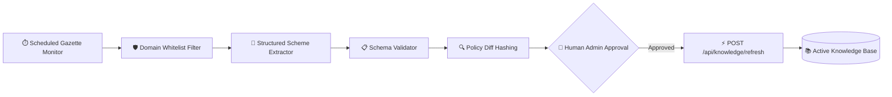

# 🌿 Arogya Nexus (ஆரோக்கிய நெக்ஸஸ்)
### AI-Powered Multilingual Rural Healthcare & Personalized Government Scheme Intelligence Platform

[](#)
[](#)
[](#)
[](#)
[](#)
[-00e676.svg)](#)

---

## 1. Project Title
**Arogya Nexus (ஆரோக்கிய நெக்ஸஸ்)** — *Personalized Government Health Scheme Intelligence & AI Rural Healthcare Platform*

---

## 2. Problem Statement
In rural India, millions of citizens face critical challenges accessing healthcare and welfare benefits:
1. **Low Awareness of Government Health Schemes**: Essential welfare schemes (such as Dr. Muthulakshmi Reddy Maternity Scheme, CMCHIS, and PM-JAY) remain underutilized due to lack of personalized, clear eligibility guidance.
2. **Language & Dialect Barriers**: Medical advice and government gazettes are predominantly in complex English or formal terms that rural citizens cannot easily comprehend.
3. **Delayed Emergency Triage**: Critical red flags (e.g., severe chest pain, acute breathlessness, snakebite, maternal bleeding) are often missed or misjudged before reaching a Primary Health Centre (PHC).
4. **Lack of Personalization**: Citizens don't know which schemes apply specifically to their family income, pregnancy status, child age, senior citizens, or chronic conditions.

---

## 3. Proposed Solution
**Arogya Nexus** transforms from a clinical chatbot into a **Personalized Government Health Scheme Intelligence Platform**:
- **Personal Health & Eligibility Profile**: Device-private, optional patient profile evaluating age, gender, state, income, family size, pregnancy, child/elderly status, and chronic conditions.
- **Explainable Scheme Eligibility Engine**: Rule-based evaluator providing standard status badges (`Likely Eligible`, `Possibly Eligible`, `More Information Needed`), matched profile criteria, missing information lists, and required documents.
- **Intent-Driven Scheme Recommendation**: Recommends top 3 verified schemes given natural queries or health profiles without requiring users to know scheme names.
- **Side-by-Side Scheme Comparison**: Structured comparison between schemes (e.g. *CMCHIS vs PM-JAY*, *MRMBS vs PMMVY vs JSY*) without biased claims of universal superiority.
- **Voice-First Indic Pipeline**: Conversational Tamil, Tanglish, and English via Sarvam AI STT (`saaras:v3`), Indic LLM (`sarvam-105b`), and natural TTS (`bulbul:v3`).
- **Emergency Priority Guardrail**: 108 Emergency Ambulance triage always takes absolute precedence over scheme inquiries for acute symptoms.
- **n8n Automation Blueprint**: Automated pipeline for official gazette change detection, schema extraction, validation checkpoints, and safe memory cache reload (`/api/knowledge/refresh`).

---

## 4. Target Users
1. **Rural Citizens & Low-Income Families**: Discovering welfare benefits, subsidies, doorstep medicines, and cash incentives in their mother tongue.
2. **Village Health Nurses (VHNs) & ASHA Workers**: Assessing maternal/child eligibility and explaining required documentation in the field.
3. **Primary Health Centre (PHC) & e-Sevai Staff**: Guiding patients to relevant state and central welfare programs during outpatient triage.

---

## 5. Key Capabilities (Phase 3)

### 👤 1. Personal Health Profile (`HealthProfile.jsx`)
- Configures State (Tamil Nadu / Other), District, Age, Gender, Income Ceiling (< ₹1.2L, ₹1.2L - ₹2.5L, > ₹2.5L), Family Size, Pregnancy Status, Child Status, Senior Status, Chronic Conditions (Hypertension, Diabetes, Cardiac, Kidney), and Occupation/Welfare Board.
- Stored privately in `localStorage` (`arogya_patient_profile`) — zero unnecessary sensitive data transmitted to external LLMs.

### 📊 2. Rule-Based Eligibility Engine (`eligibilityService.py`)
- Evaluates 9 government schemes against profile criteria.
- Adheres strictly to Trust & Safety rules:
  - Standardized Status: `"Likely Eligible"`, `"Possibly Eligible"`, `"More Information Needed"`, `"Not Determined"`.
  - Never claims definitive eligibility; provides official verification disclaimers.
  - Highlights explicit missing information required for confirmation.

### 🎯 3. Scheme Recommendation Engine (`schemeRecommendationService.py`)
- Fuses user semantic intent (Tamil, Tanglish, English) with patient profile attributes.
- Returns top 3 ranked recommendations with match reasoning, key benefits, next action steps, and official portal URLs.

### ⚖️ 4. Side-by-Side Scheme Comparison (`SchemeComparison.jsx`, `schemeComparisonService.py`)
- Popular comparison presets (*CMCHIS vs PM-JAY*, *Maternity: MRMBS vs PMMVY vs JSY*, *Chronic: MTM vs NPHCE*, *Trauma: NK48 vs CMCHIS*) + custom multi-selector.
- Evaluates contextual applicability rather than claiming one scheme is universally "better".

### 🔄 5. n8n Automated Update Pipeline (`docs/n8n-scheme-update-workflow.md`)
- Scheduled cron / gazette change detection $\rightarrow$ domain whitelist fetch $\rightarrow$ schema extraction $\rightarrow$ automated validation $\rightarrow$ human checkpoint $\rightarrow$ `POST /api/knowledge/refresh`.

---

## 6. Verified Government Schemes in Knowledge Base

The knowledge base contains 9 structured, verified scheme cards with official sources and timestamps:

| Scheme ID | Scheme Name & Authority | Target Group & Scope | Key Benefits |
| :--- | :--- | :--- | :--- |
| `cmchis-tamil-nadu` | **CMCHIS** (Govt of Tamil Nadu) | Low-income families (< ₹1.2L/yr) in TN | ₹5 Lakh/yr cashless secondary/tertiary hospital care |
| `ayushman-bharat-pmjay` | **Ayushman Bharat PM-JAY & ABHA** (NHA) | Bottom 40% vulnerable households (SECC) | ₹5 Lakh/yr cashless coverage across India |
| `mrmbs-dr-muthulakshmi-reddy` | **MRMBS** (TN Directorate of Public Health) | Pregnant mothers in TN (19+ yrs, BPL) | ₹18,000 financial support + 2 Amma Nutrition Kits |
| `janani-suraksha-yojana-jsy` | **Janani Suraksha Yojana** (NHM) | Pregnant mothers in public facilities | ₹700 (urban) / ₹1,400 (rural) cash assistance |
| `pmmvy-pradhan-mantri-matru-vandana` | **PMMVY** (MoWCD / NHM) | Pregnant / lactating mothers (1st/2nd child) | ₹5,000 - ₹6,000 direct bank transfer installments |
| `makkalai-thedi-maruthuvam` | **Makkalai Thedi Maruthuvam** (TN NHM) | 45+ yrs, Hypertension, Diabetes in TN | Doorstep delivery of chronic medicines & palliative care |
| `nammai-kaakkum-48-innisaikarangal` | **Innuyir Kaappom - NK48** (Govt of TN) | Road traffic accident victims in TN | First 48 hrs emergency trauma care up to ₹1,00,000 |
| `rbsk-rashtriya-bal-swasthya` | **RBSK** (National Health Mission) | Children & adolescents (0 to 18 years) | Free screening & treatment for 4Ds (Defects, Delays) |
| `nphce-elderly-care` | **NPHCE** (MoHFW) | Senior citizens (60 years and above) | Geriatric clinics, specialized physiotherapy & medicines |

---

## 7. Complete Architecture

```mermaid
flowchart TD
    User([👤 Rural Citizen / VHN / Patient]) --> WebUI[🖥️ React 19 Frontend<br/>(Voice, Chat, Profile, Compare)]
    
    subgraph UI_Tabs [Frontend Experience]
        WebUI --> Tab1["🎙️ Voice & Chat"]
        WebUI --> Tab2["👤 My Eligibility"]
        WebUI --> Tab3["🎯 Recommended Schemes"]
        WebUI --> Tab4["⚖️ Compare Schemes"]
    end

    WebUI --> API[⚡ FastAPI Backend]

    subgraph Service_Layer [Intelligence & AI Services]
        API --> STT[🎙️ Sarvam STT 'saaras:v3']
        API --> EligEngine["📊 Eligibility Engine<br/>(eligibilityService.py)"]
        API --> RecEngine["🎯 Recommendation Engine<br/>(schemeRecommendationService.py)"]
        API --> CompEngine["⚖️ Comparison Service<br/>(schemeComparisonService.py)"]
        API --> LLM["🧠 Sarvam LLM 'sarvam-105b'<br/>(llmService.py)"]
        API --> TTS[🔊 Sarvam TTS 'bulbul:v3']
    end

    subgraph Knowledge_Layer [Explainable RAG Layer]
        EligEngine --> KB[(📚 18 Verified Cards<br/>9 Schemes + 9 Clinical)]
        RecEngine --> KB
        CompEngine --> KB
        LLM --> KB
    end

    subgraph Automation_Layer [n8n Update Pipeline]
        n8n[🔄 n8n Scheduled Workflow] -->|POST /api/knowledge/refresh| API
        KB -.->|Zero-Downtime Reload| API
    end
```

---

## 8. API Specifications

### `POST /api/profile/eligibility`
- **Request**:
  ```json
  {
    "profile": {
      "age": 28,
      "gender": "Female",
      "state": "Tamil Nadu",
      "district": "Madurai",
      "annual_income": 95000,
      "is_pregnant": true
    }
  }
  ```
- **Response**:
  ```json
  {
    "status": "success",
    "total_evaluated": 9,
    "schemes": [
      {
        "scheme_id": "mrmbs-dr-muthulakshmi-reddy",
        "scheme_name": { "en": "Dr. Muthulakshmi Reddy Maternity Benefit Scheme (MRMBS)", "ta": "டாக்டர் முத்துலட்சுமி ரெட்டி மகப்பேறு நிதி உதவித் திட்டம்" },
        "eligibility_status": "Likely Eligible",
        "matched_criteria": ["Pregnant mother status", "Resident of Tamil Nadu", "Eligible age demographic (19 years and above)"],
        "missing_information": ["PICME 12-digit RCH ID registration before 12 weeks of pregnancy", "Applicable for first 2 deliveries only"],
        "possible_reason": "Pregnant woman residing in Tamil Nadu eligible for ₹18,000 assistance and 2 Nutrition Kits.",
        "official_source": "Government of Tamil Nadu, Health & Family Welfare Department",
        "official_url": "https://picme.tn.gov.in/",
        "last_verified": "2026-08-20",
        "disclaimer": "Final eligibility must be confirmed with the official government authority."
      }
    ],
    "disclaimer": "Final eligibility must be confirmed with the official government authority."
  }
  ```

### `POST /api/schemes/recommend`
- **Request**:
  ```json
  {
    "profile": { "state": "Tamil Nadu", "is_pregnant": true },
    "query": "maternity financial assistance and nutrition",
    "top_k": 3
  }
  ```

### `POST /api/schemes/compare`
- **Request**:
  ```json
  {
    "scheme_ids": ["cmchis-tamil-nadu", "ayushman-bharat-pmjay"]
  }
  ```

### `POST /api/knowledge/refresh`
- Validates knowledge cards on disk and refreshes in-memory cache without server downtime.
- Used by n8n automated update pipelines and admin triggers.

---

## 9. Production-Grade n8n Automation Architecture

Arogya Nexus uses **n8n** as an intelligent orchestration layer to automate official government scheme updates with zero downtime and strict human-in-the-loop governance:



### Importable Master Workflow:
- **File**: [`n8n/Arogya_Nexus_Master_Scheme_Intelligence_Pipeline.json`](file:///c:/Users/deeps/OneDrive/Arogya-Nexus/n8n/Arogya_Nexus_Master_Scheme_Intelligence_Pipeline.json)
- **Detailed Integration Guide**: [`docs/n8n-production-integration-guide.md`](file:///c:/Users/deeps/OneDrive/Arogya-Nexus/docs/n8n-production-integration-guide.md)
- **Sample Payloads**: [`n8n/sample_payloads/`](file:///c:/Users/deeps/OneDrive/Arogya-Nexus/n8n/sample_payloads/)

---

## 10. Testing & Verification

Run Knowledge Base Schema Validation:
```bash
python backend/data/validate_knowledge_base.py
```

Run Comprehensive 20-Scenario Phase 3 Verification Suite:
```bash
python backend/tests/test_phase3_suite.py
```

Run n8n Production Pipeline Live Simulation (against Cloudflare Tunnel):
```bash
python backend/tests/test_n8n_integration_sim.py
```

Run Phase 2 Regression Suite:
```bash
python backend/tests/test_phase2_suite.py
```

Run Frontend Production Build & Linter:
```bash
npm run build
npx oxlint
```

---

## 11. How to Run Locally

```bash
# 1. Start Backend Server
python -m uvicorn main:app --app-dir backend --host 127.0.0.1 --port 8000

# 2. In another terminal, start Public Cloudflare Tunnel (for n8n Cloud access)
.\cloudflared.exe tunnel --protocol http2 --url http://127.0.0.1:8000

# 3. In another terminal, start Frontend
npm run dev
```
Open `http://localhost:5173` in your browser.

---

## 12. Safety & Medical Disclaimer

> **IMPORTANT DISCLAIMER**: Arogya Nexus provides supportive healthcare information and government scheme guidance. It is not a substitute for a qualified healthcare professional. In medical emergencies, immediately dial **108 Emergency Ambulance** or visit the nearest Primary Health Centre (PHC). Scheme eligibility determinations are preliminary guides; final benefit sanction requires verification by official government authorities.

