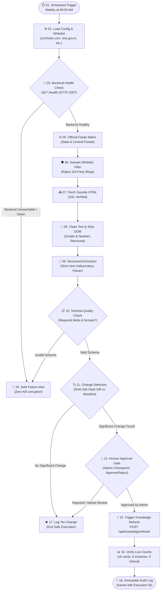

# 🔄 Arogya Nexus — Production-Grade n8n Automation Architecture & Integration Guide

## 1. Executive Summary

Arogya Nexus utilizes **n8n** as an intelligent, secure orchestration layer to automate the ingestion, validation, and in-memory refresh of official government healthcare schemes.

This architecture ensures:
1. **Zero Hallucinations**: Information is only extracted from whitelisted official government gazettes.
2. **Zero Unauthorized Overwrites**: No change reaches the live knowledge base without automated schema validation and human administrator approval.
3. **Zero Downtime**: Knowledge cards are reloaded seamlessly in memory via `POST /api/knowledge/refresh`.
4. **Resilient Failure Handling**: Unhealthy backend, malformed payloads, or rejected approvals safely terminate without corrupting existing validated data.



---

## 2. Official Domain Whitelist

n8n enforces a hardcoded domain whitelist filter in Node 06. Any URL not originating from verified government servers is rejected immediately:

| Domain | Authority & Purpose | Representative Schemes |
| :--- | :--- | :--- |
| `cmchistn.com` | Government of Tamil Nadu, Health & Family Welfare | CMCHIS (Cashless ₹5 Lakh Hospital Coverage) |
| `picme.tn.gov.in` | Directorate of Public Health & Preventive Medicine, TN | MRMBS (₹18,000 + Nutrition Kits for Pregnant Women) |
| `nha.gov.in` / `pmjay.gov.in` | National Health Authority, Government of India | Ayushman Bharat PM-JAY & ABHA Health Card |
| `nhm.gov.in` | National Health Mission (MoHFW) | JSY, PMMVY, RBSK (Child Screening), NPHCE |
| `tnhsp.tn.gov.in` | Tamil Nadu Health System Project | Makkalai Thedi Maruthuvam, Innuyir Kaappom (NK48) |
| `mohfw.gov.in` | Ministry of Health and Family Welfare, Govt of India | National Clinical Guidelines & Vector Prevention |

---

## 3. Strict AI Extraction Guardrails

When processing gazette updates through an LLM in n8n (Node 09), the following prompt constraints are enforced:

```markdown
SYSTEM ROLE: Strict Healthcare Government Policy Data Extractor
RULES:
1. Extract information ONLY from the provided text.
2. If a field (e.g., income ceiling, required document) is NOT explicitly mentioned in the official text, output null or "not specified".
3. NEVER assume or hallucinate financial assistance amounts, eligibility rules, or hospital names.
4. Output must strictly adhere to the standard Arogya Nexus JSON schema.
```

---

## 4. Change Detection & Differential Hashing

Node 11 computes a deterministic SHA-256 hash across critical policy fields:
- `income_ceiling`
- `target_beneficiaries`
- `benefits_list`
- `eligibility_criteria`
- `required_documents`
- `official_url`

If the computed hash matches the current stored baseline hash, the workflow flags `has_significant_change: false`, logs a clean audit record, and halts without triggering unnecessary LLM synthesis or administrator review.

---

## 5. Human-in-the-Loop Approval Checkpoint

Before any change is committed to the live knowledge base, Node 13 generates a structured review payload:
- **Scheme Name**: Chief Minister's Comprehensive Health Insurance Scheme (CMCHIS)
- **Official Source**: `https://www.cmchistn.com/`
- **Detected Modifications**: Changes in income verification procedure (online Tahsildar certificate).
- **Risk Assessment**: `LOW_TO_MEDIUM`
- **Options**: `[ APPROVE | REJECT | REVIEW_AGAIN ]`

Only upon receiving an explicit `APPROVE` decision does n8n proceed to trigger the backend reload.

---

## 6. Live Knowledge Base Refresh

Upon approval, Node 15 executes an authenticated `POST` request to the Arogya Nexus backend:
```http
POST https://improved-api-healing-microwave.trycloudflare.com/api/knowledge/refresh
Content-Type: application/json

{}
```

### Expected Live Response:
```json
{
  "status": "success",
  "message": "Knowledge base validated and refreshed successfully.",
  "total_cards": 18,
  "scheme_cards_count": 9,
  "healthcare_cards_count": 9,
  "timestamp": "2026-08-24 22:41:47"
}
```

---

## 7. Step-by-Step n8n Cloud Configuration

1. **Import the Workflow**:
   - Open your n8n Cloud / self-hosted dashboard.
   - Click **Add Workflow** $\rightarrow$ **Import from File**.
   - Select [`n8n/Arogya_Nexus_Master_Scheme_Intelligence_Pipeline.json`](file:///c:/Users/deeps/OneDrive/Arogya-Nexus/n8n/Arogya_Nexus_Master_Scheme_Intelligence_Pipeline.json).

2. **Set Environment Variables in n8n**:
   - `AROGYA_BACKEND_URL`: Set to `https://improved-api-healing-microwave.trycloudflare.com` (or your production domain).

3. **Activate the Workflow**:
   - Toggle the workflow status to **Active** to enable the weekly scheduled trigger.

---

## 8. Hackathon Demonstration Playbook

### Scenario A: Successful Scheme Update (Happy Path)
1. Trigger the workflow manually in n8n.
2. Observe Node 03 successfully verifying backend health (`HTTP 200`).
3. Observe Node 06 confirming whitelisted official domains (`cmchistn.com`).
4. Review the change diff generated in Node 11.
5. Provide `APPROVE` decision in Node 13.
6. Observe Node 15 calling `POST /api/knowledge/refresh` on the live Cloudflare HTTPS URL.
7. Confirm Node 16 verifying **18 total cards** active in memory.

### Scenario B: Safe Failure on Backend Outage (Resilience Test)
1. Stop the backend process or point to an invalid URL.
2. Trigger the workflow in n8n.
3. Observe Node 04 detecting health check failure (`HTTP != 200`).
4. Observe immediate routing to Node 18 (**Failure Alert & Safe Termination**).
5. Confirm that existing knowledge cards remain 100% untouched and uncorrupted.
