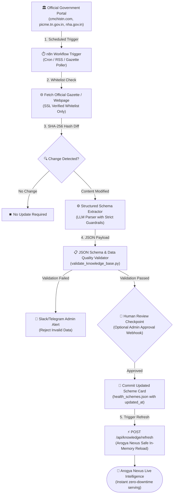

# 🔄 n8n Automated Government Scheme Intelligence Update Pipeline

## Overview

Arogya Nexus is designed with an **Explainable, Verified-First RAG Architecture**. To maintain the highest clinical and governmental data integrity without manual redeployments, future **n8n automated workflows** can keep the knowledge base up to date with official government gazettes, NHM policy updates, and state health portal amendments.



---

## 8-Step Automated Workflow Architecture

### Step 1: Trigger Mechanism
- **Schedule**: Recurring cron trigger (e.g. weekly or monthly) or webhook notification from State Government Gazette / NHM feeds.
- **Environment**: n8n self-hosted or cloud instance with secure credential storage.

### Step 2: Official Source Retrieval
- **Domain Whitelist Enforcement**: n8n is strictly constrained to fetch from configured official government sources only:
  - `https://www.cmchistn.com/` (TN Health Department - CMCHIS)
  - `https://picme.tn.gov.in/` (TN Directorate of Public Health - MRMBS & Antenatal)
  - `https://nha.gov.in/` / `https://pmjay.gov.in/` (National Health Authority - PM-JAY)
  - `https://nhm.gov.in/` (National Health Mission - RBSK, JSY, PMMVY, NPHCE)
  - `https://tnhsp.tn.gov.in/` (Tamil Nadu Health System Project - MTM, Innuyir Kaappom)
- **Security Rule**: Arbitrary or unverified third-party blogs/sites are strictly blocked.

### Step 3: Change Detection
- Computes SHA-256 hashes of the target policy/eligibility HTML sections.
- Compares against stored hash from previous version.
- If no content change is detected, the workflow terminates safely without creating unnecessary diffs.

### Step 4: Structured Schema Extraction
- When verified content changes, n8n executes an extraction prompt to transform raw gazette/webpage updates into the standard Arogya Nexus schema:
  - `id`, `scheme_name` (`en`/`ta`), `short_description`, `purpose`, `eligibility` (`en`/`ta`), `benefits` (`en`/`ta`), `required_documents` (`en`/`ta`), `how_to_apply`, `where_to_apply`, `official_source`, `official_url`, `last_verified`, `updated_at`, `source_status`.

### Step 5: Automated Schema Validation
- Runs `backend/data/validate_knowledge_base.py` on the extracted JSON.
- Verifies:
  - All mandatory scheme fields are non-empty.
  - Card ID matches existing unique ID pattern.
  - Official URL is well-formed.
  - No malformed JSON or broken unicode characters in Tamil text.

### Step 6: Human Review / Admin Approval Checkpoint
- Sends a structured Slack / Telegram / Email notification with the proposed diff:
  - Scheme Name & ID
  - Changed benefits or eligibility criteria
  - Source URL and extraction confidence score
- Admin clicks **Approve** or **Reject**.

### Step 7: Knowledge Base Update
- On approval, n8n writes the validated JSON card into `backend/data/knowledge_base/health_schemes.json`.
- Stamps `updated_at: "YYYY-MM-DD"`, `source_status: "verified_active"`, and retains the previous version in git revision history.

### Step 8: Safe Zero-Downtime Memory Refresh
- n8n triggers the internal Arogya Nexus endpoint:
  ```http
  POST /api/knowledge/refresh
  Content-Type: application/json
  ```
- Arogya Nexus backend:
  1. Re-validates all on-disk cards (`validate_knowledge_base()`).
  2. Resets the in-memory singleton cache (`reload_knowledge_base()`).
  3. Returns updated statistics:
     ```json
     {
       "status": "success",
       "message": "Knowledge base validated and refreshed successfully.",
       "total_cards": 18,
       "scheme_cards_count": 9,
       "healthcare_cards_count": 9,
       "timestamp": "2026-08-24 21:00:00"
     }
     ```
  4. Immediately serves updated scheme guidance to voice and chat users without server restart.

---

## Safety & Trust Guarantees

1. **No Silent Overwrites**: Every update requires automated schema validation and human checkpoint approval.
2. **Strict Whitelisting**: Never ingests data from unverified web search results or unofficial blogs.
3. **Traceability**: Every scheme card maintains an immutable record of `official_source`, `official_url`, `last_verified`, and `updated_at`.
4. **Resilience**: If any validation rule fails, the existing verified in-memory dataset remains untouched.
